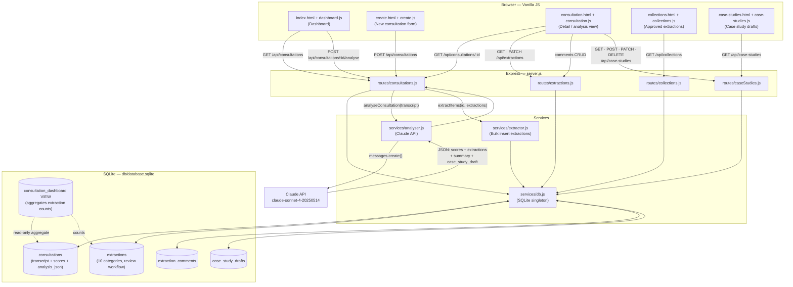

# Consultation Intelligence Engine — Claude Instructions

## Plan Maintenance

A `PLAN.md` file tracks the project roadmap. Keep it up to date as we work:

- When a task is completed, mark it `- [x]` in the relevant version section
- When a new task is identified, add it to the appropriate version section
- If a version is fully complete, add ✅ to its heading

## General

- This is a B2C sales consultation analysis tool for The Home Organisation
- Frontend is plain HTML/CSS/JS — no frameworks, no build step
- SQLite is the database — avoid patterns that cause concurrent write issues
- Keep API responses consistent with existing endpoint structure
- Project uses `"type": "module"` (ESM) throughout — all imports use ES module syntax
- Migration scripts follow the pattern in `scripts/migrate-review.js`: open DB directly, run `ALTER TABLE`/`CREATE TABLE IF NOT EXISTS`, catch errors for already-existing columns, then close
- The `db` singleton in `src/services/db.js` is shared across all routes — don't create additional Database instances in route files

## File Map

### Entry Point & Config
- **`server.js`** — Express app entry: registers JSON middleware, static files, all four API routers, and the error handler
- **`env.js`** — Single-line dotenv loader; imported first by `server.js` to populate `process.env`
- **`package.json`** — ESM project; scripts: `start`, `dev` (node --watch), `setup` (init DB), `migrate` (run migration scripts)

### Auth & Session
- **`src/services/passportConfig.js`** — Registers passport Google OAuth strategy (side-effect import); serializeUser/deserializeUser using the `users` table; checks email allowlist from `ALLOWED_EMAILS`; stores refresh token
- **`src/middleware/auth.js`** — `requireAuth` middleware: passes if `req.isAuthenticated()`, returns 401 JSON for `/api/` paths, redirects other paths to `/login` storing `returnTo` in session
- **`src/routes/auth.js`** — `/auth/google` (start OAuth), `/auth/google/callback` (complete + redirect), `/auth/me` (current user JSON), `POST /auth/logout` (destroy session + redirect)
- **`public/login.html`** — Standalone login page with Google sign-in button; shows error message if `?error=unauthorised` is in the query string

### Google Integration
- **`src/services/googleClient.js`** — `getOAuth2Client(userId)`: builds an `OAuth2Client` using the stored refresh token for that user; throws 401 if no token found
- **`src/services/driveService.js`** — `listDriveFiles(userId)`: lists files in `GOOGLE_DRIVE_FOLDER_ID`; `getDriveFileContent(userId, fileId, mimeType)`: exports Google Docs as plain text or downloads other files
- **`src/routes/drive.js`** — `GET /api/drive/files` (list folder with `alreadyImported` flag), `POST /api/drive/import` (download + create consultation with `drive_file_id`)
- **`src/services/calendarService.js`** — `getUpcomingEvents(userId, days=14)`: fetches events from `GOOGLE_CALENDAR_ID`, attempts fuzzy name-match against `consultations.client_name`
- **`src/routes/calendar.js`** — `GET /api/calendar/events`: returns upcoming events with optional `linkedConsultationId`

### API Routes (`src/routes/`)
- **`consultations.js`** — CRUD for consultations + `POST /:id/analyse` which calls Claude, stores scores, and calls `extractItems()`
- **`extractions.js`** — Filtered GET, PATCH (review/edit/tags), and nested comment CRUD on extracted intelligence items
- **`collections.js`** — Read-only views of approved extractions: list by category, stats, and CSV/JSON export
- **`caseStudies.js`** — CRUD for `case_study_drafts` records, joined with client name from consultations

### Services (`src/services/`)
- **`db.js`** — better-sqlite3 singleton with `getOne`, `getAll`, `run`, `transaction` helpers; DB at `db/database.sqlite`
- **`analyser.js`** — Sends transcript to Claude (`claude-sonnet-4-20250514`, 16k tokens) with a ~450-line prompt; returns parsed JSON with framework scores, 10 extraction categories, summary, top 3 improvements, and a case study draft template
- **`extractor.js`** — `extractItems(consultationId, extractions)`: iterates the 10-category extractions object from Claude and bulk-inserts rows into the `extractions` table inside transactions

### Middleware
- **`src/middleware/errorHandler.js`** — Global Express error handler; returns JSON with stack trace in development

### Frontend Pages (`public/`)
- **`index.html`** — Dashboard shell: consultations table + empty state; loads `dashboard.js`
- **`create.html`** — Form for manually creating a consultation (client name, consultant, date, duration, transcript text)
- **`consultation.html`** — Detail view with four tabs: Scorecard, Extractions, Transcript, Case Study
- **`collections.html`** — Knowledge base of approved extractions, viewable by category or destination tag
- **`case-studies.html`** — Table listing all case study drafts across consultations

### Frontend JS (`public/js/`)
- **`app.js`** — Shared utilities: `api()` fetch wrapper, `toast()`, `esc()`, `formatDate()`, `getStatusBadge()`, `DESTINATION_TAGS` array, `CATEGORY_META` object
- **`dashboard.js`** — Loads consultations via `GET /api/consultations`, renders the table, handles the "Analyse" button via `POST /:id/analyse`
- **`create.js`** — Submits the create form via `POST /api/consultations`, then redirects to the detail page
- **`consultation.js`** — Largest frontend file: tab switching, scorecard rendering (framework bar charts + criterion rows), extraction review/edit/tag workflow, transcript line-by-line rendering with speaker detection, case study form, and comment threads
- **`collections.js`** — Loads approved extractions, renders grouped by category or destination tag with a filter dropdown
- **`case-studies.js`** — Fetches all case study drafts and renders a table linking back to the consultation detail page

### Database
- **`db/schema.sql`** — Source-of-truth schema: `consultations`, `extractions`, `extraction_comments`, `case_study_drafts` tables plus `consultation_dashboard` VIEW
- **`db/database.sqlite`** — Live SQLite database file (binary, not in git)

### Scripts (`scripts/`)
- **`setup-db.js`** — Reads `schema.sql` and runs `db.exec()` to initialise a fresh database
- **`migrate-review.js`** — Adds review workflow columns to `extractions` and rebuilds the `consultation_dashboard` view with pending/approved counts
- **`migrate-collections.js`** — Creates `extraction_comments` and `case_study_drafts` tables if they don't exist
- **`migrate-auth.js`** — Creates `users` table (`id` = Google sub, `email`, `display_name`, `avatar_url`, `refresh_token`, timestamps)
- **`migrate-drive.js`** — Adds `drive_file_id TEXT` column + unique index to `consultations`

---

## Data Flow Diagram

### Key Analysis Pipeline (step by step)

1. User creates consultation via `create.html` → stored in `consultations` with `analysis_status = 'pending'`
2. Dashboard "Analyse" button → `POST /api/consultations/:id/analyse`
3. Route sets status to `'analysing'`, calls `analyseConsultation(transcript_text)`
4. `analyser.js` builds prompt from `PROMPT_TEMPLATE`, sends to Claude, parses JSON response
5. Claude returns: `framework_scores` (6 frameworks, max 220pts), `extractions` (10 categories), `executive_summary`, `top_3_improvements`, `case_study_draft`, `consultation_template_notes`
6. Route stores full JSON in `analysis_json`, denormalises 8 score columns, sets status to `'complete'`
7. `extractItems()` bulk-inserts each extraction item into `extractions` table with `review_status = 'pending'`
8. Case study draft lives inside `analysis_json`; users manually save it to `case_study_drafts` via the Case Study tab

### Database Schema Summary

| Table | Key columns |
|-------|-------------|
| `consultations` | `id`, `client_name`, `transcript_text`, `analysis_status`, `analysis_json`, `score_composite_pct`, 6 framework score columns |
| `extractions` | `id`, `consultation_id`, `category` (10 values), `insight`, `quote`, `confidence`, `review_status` (pending/approved/rejected/parked), `destination_tags` (JSON array), `insight_edited` |
| `extraction_comments` | `id`, `extraction_id`, `comment_text` |
| `case_study_drafts` | `id`, `consultation_id`, `headline`, `client_situation`, `catalyst`, `challenge`, `approach`, `key_quote`, `outcome`, `call_to_action`, `edit_status` (draft/reviewed/published) |
| `consultation_dashboard` | VIEW — joins consultations + extraction counts (total/approved/pending) |
